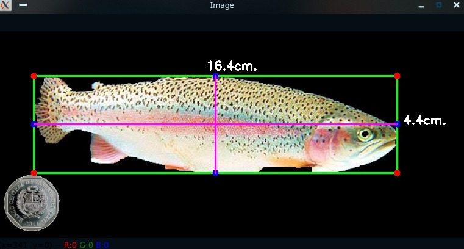

# Fish classifier

This algoritm provided by [PyImageSearch](https://www.pyimagesearch.com/2016/03/28/measuring-size-of-objects-in-an-image-with-opencv/) measure the objects in the image based on the left-most object. 


### Example

Peruvian sol dimensions


Trout example dimensiones



## Clone this repo

```
git clone https://github.com/DZPeru/fish-classifier
```

## Install requirements

```
pip3 install -r requirements.txt
```

## How to run

```
python3 measure.py --image image.jpg --width 2.5
```

Where width is the width of the left-most object in the image in centimeters. In the case of peruvian sol (PEN), the diameter is 2.55 cm.
